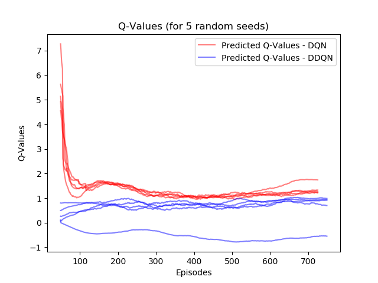

# Double Deep Q-Learning with Atari Environments

## Deep Reinforcement Learning with Double Q Learning

### An example of the agent playin Demon Attack
This agent was trained on a Double Deep Q Network (DDQN).

### Estimation of Q Values
One of the main takeaways of Double Q Learning is that the estimates Q values are lower than for Q Learning. This allows for DDQN to out perform DQN.

## Directory Structure

├── docs                        # Non-code documents

├── figures                     # Images and graphs

├── misc_code_examples          # Any useful examples of RL implementations

├── misc_models

├── src                         # Code for our implementation of the project

└── README.md

## Final Results
These videos show our agents being evaluated on their respectively trained games. The games shown are Demon Attack, Robotank, Pong, and Zxxon.

<https://www.youtube.com/watch?v=6LGKKiaE8rw>

<https://www.youtube.com/watch?v=A8NQa2PG5Gw>

# Contributors
Jacob Heglund, Nitin Tangellamudi, Sahil Kumar, Jake Headings, Xinbo Wu

# References and Acknowledgement

[1] Base code forked from <https://github.com/higgsfield/RL-Adventure>

[2] Hasselt H., Guez A., Silver D. Deep Reinforcement Learning with Double Q-Learning

Thanks to professor Sirignano and the Blue Waters Supercomputer team at the University of Illinois for providing the resources to be able to train these agents for over 2000 hours.

